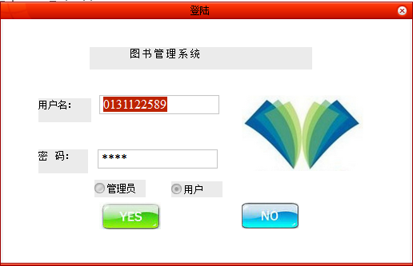
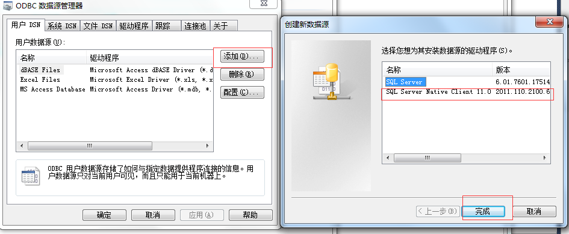
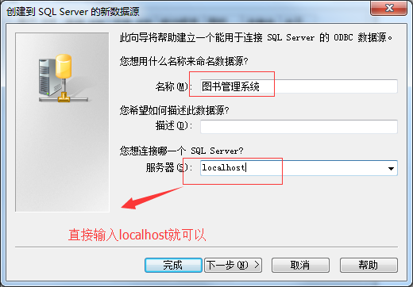
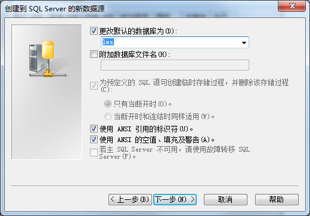
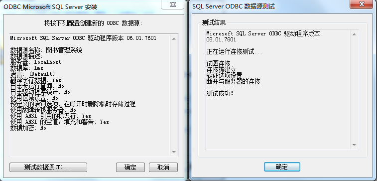

图书管理系统（Library management system）
----

我的博客：[并非菜鸟](https://songyaxu.github.io)
=====

#介绍

这个系统是我学习了一个学期的Visual C++（MFC）所写的。
功能什么的还是比较复杂的，在一开始接触这块的时候，都不是知道如何使用C++获取数据库中的数据。下了很大的功夫。
最后还可以读写EXCEL和Word文件、还是用了UI库，功能也算是比较完善了。




> 如何创建ODBC数据源：
1. 搜索程序输入：ODBC
2. 
3. 
4. 
5. 
6. 其中lms是我们创建的数据库名称
7. 图书管理系统 是数据源的名称，使我们在代码中使用的！
``` c++
CString CAdmin::GetDefaultConnect()
{
	return _T("ODBC;DSN=图书管理系统");
}
```
