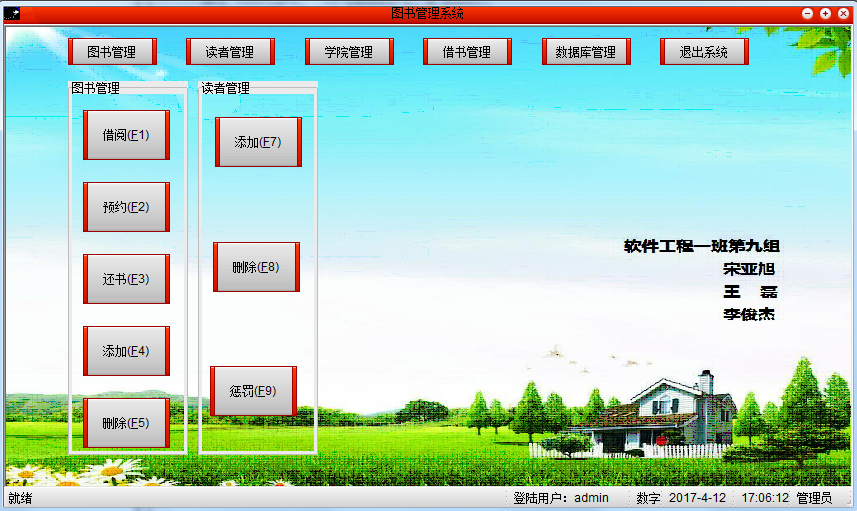
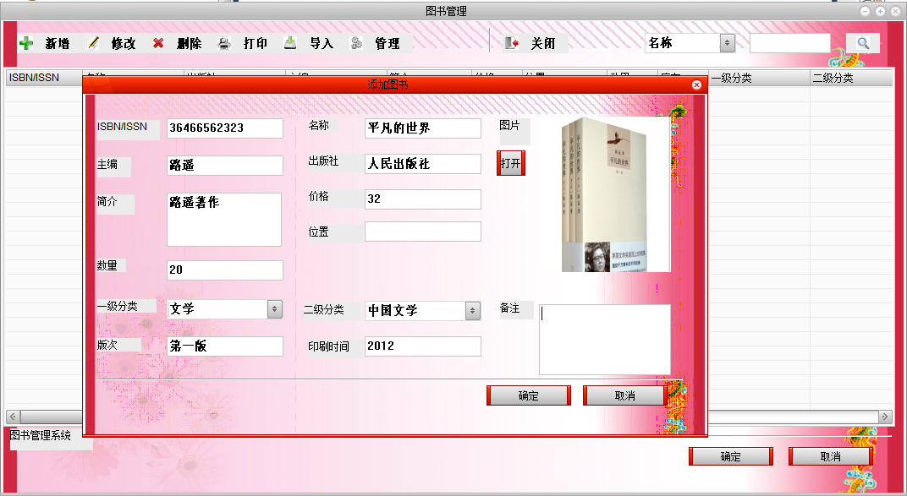
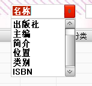
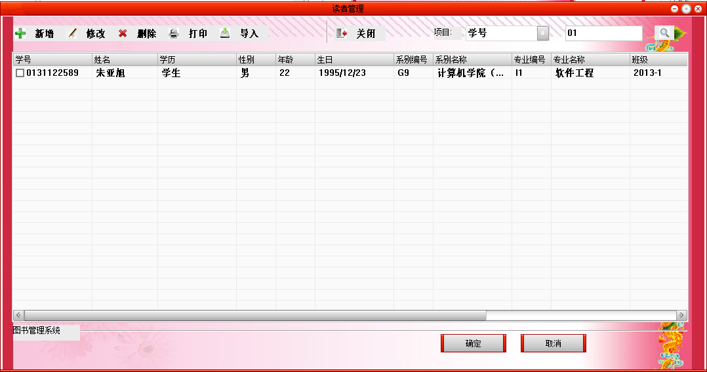
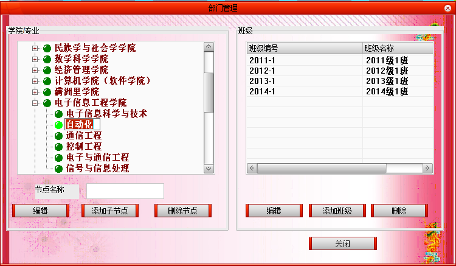
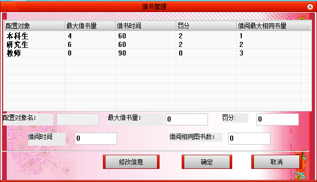
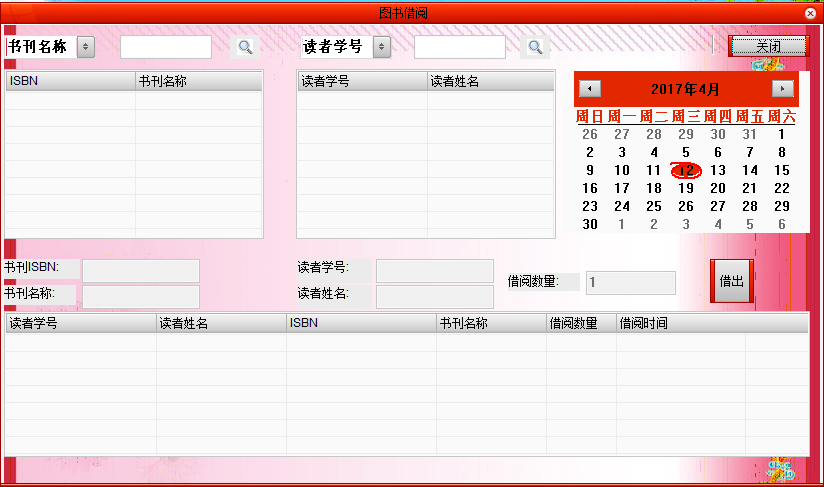
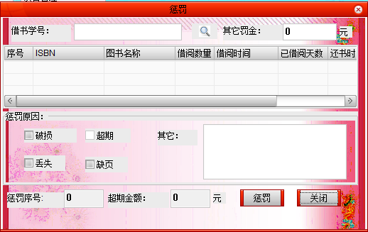
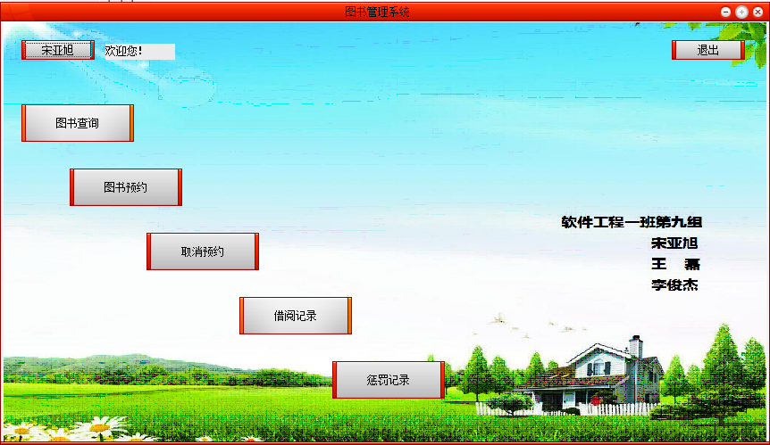
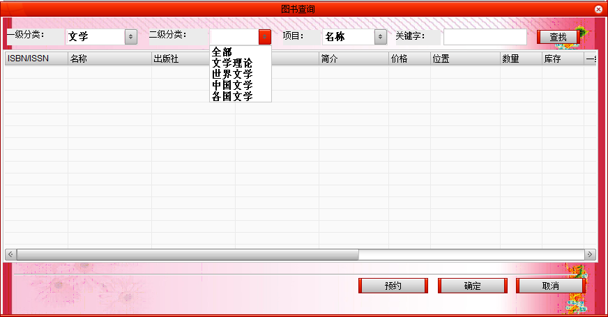

图书管理系统（Library management system）
----

我的博客：[并非菜鸟](https://songyaxu.github.io)
=====

# 介绍

这个系统是我学习了一个学期的Visual C++（MFC）所写的。
功能什么的还是比较复杂的，在一开始接触这块的时候，都不是知道如何使用C++获取数据库中的数据。下了很大的功夫。
最后还可以读写EXCEL和Word文件、还是用了UI库，功能也算是比较完善了。


# 项目配置

> 如何创建ODBC数据源：
> 1. 搜索程序输入：ODBC
> 2. 
> 3. 
> 4. 
> 5. 
> 6. 其中lms是我们创建的数据库名称
> 7. 图书管理系统 是数据源的名称，使我们在代码中使用的！
``` c++
CString CAdmin::GetDefaultConnect()
{
	return _T("ODBC;DSN=图书管理系统");
}
```
我使用IDE是Visual C++ 6.0。
使用编译器打开源码，然后看到项目的目录结构大概是这个样子的。


还算是清晰吧。
我现在已经把所有的sql脚本生成了，可以直接使用。可以说我的前期工作做得还是很多的
>
+ 图书的一级分类、二级分类。
+ 大量的人员信息、大量的图书信息。
+ EXCEL、WORD的导入导出。
+ 真实的院校结构、真实的图书信息。

我的sql中只有一个管理员，和一个读者，和几本图书。大家使用时可以通过管理员账户快速的添加读者和图书。
通过导入功能可以参照模板

+ [100图书信息表.xls](templates/100图书信息表.xls)
+ [1050读者信息表.xls](templates/1050读者信息表.xls)

不过使用导入功能必须安装office2013版本的，低版本的肯定不行，高版本的没有尝试过。

## 程序一览

###### 管理员登录首界面：



- 可以看到功能是不是很强大？
- 界面有点难看，但是真的无能为力。
- 所有功能都实现了。

###### 图书管理：



这里搜索的话支持很多的



而且相信你也看到了上边的所有按钮，都是实现了的。

###### 读者管理：


读者管理和图书管理类似的。

###### 院系管理界面：



这里可以添加和修改院系、专业、班级。


###### 借书管理界面：


这里可以配置不同用户借书的不同设置。
###### 其它界面：




###### 用户界面：



###### 图书查询：

 

## 总结

> 先说一下，因为自己很早以前做的，想要配置起来环境真的很不容易。然而我自己也没有使用office 2013,所以导入导出我这里也没法完成。
>
> 东西还是比较多的，许多时候需要慢慢来理解，可是做出来却觉得功能很少，好像很简单的样子。
> 
> 其实我这里写了很多的数据校验，为了不让我的程序出错。
> 
> 现在来看这个程序，觉得BUG还是有不少的。如果有时间的话，我会花时间去改一改。